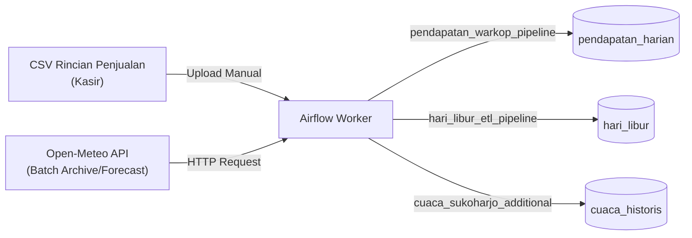
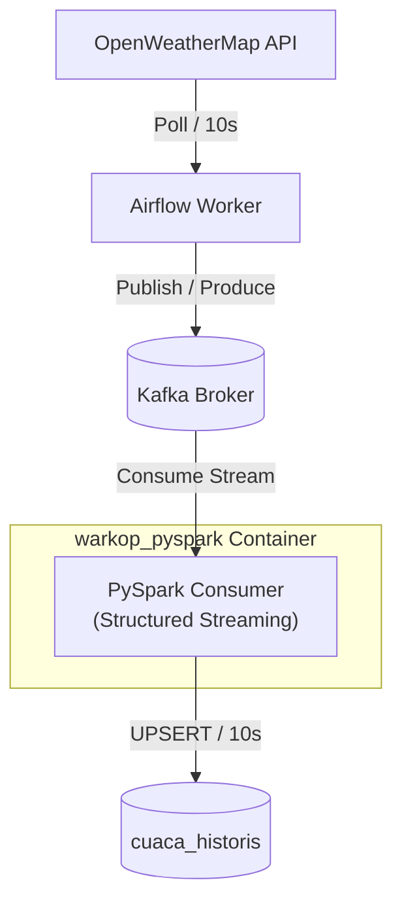
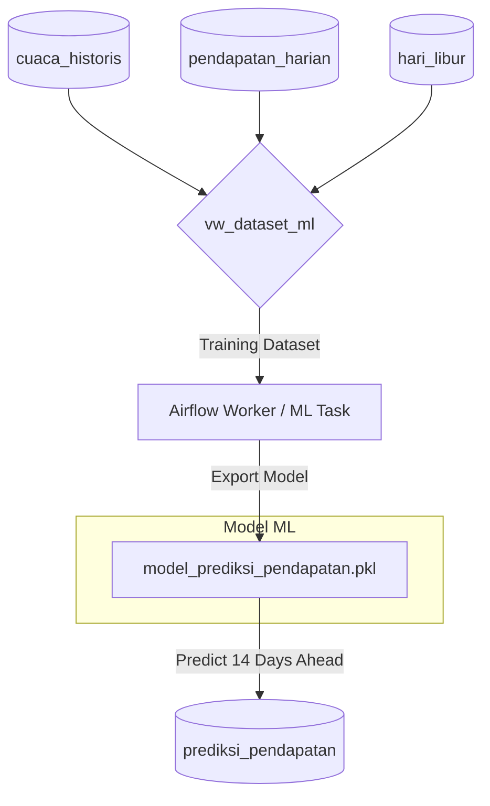

# Arsitektur Pipeline Big Data - Warkop Kusuma

Berikut adalah visualisasi arsitektur sistem terintegrasi yang telah dibangun menggunakan Mermaid diagram. Diagram ini menggambarkan aliran data (*dataflow*), pembagian *Docker Network* untuk keamanan, serta integrasi komponen *batch* dan *real-time stream*.

```mermaid
graph TB
    %% Data Sources
    subgraph Data_Sources["1. Sumber Data (External)"]
        OWM["OpenWeatherMap API<br/>(Weather Real-Time)"]
        OM["Open-Meteo API<br/>(Batch Archive & Forecast)"]
        CSV["CSV Rincian Penjualan<br/>(Manual Upload Kasir)"]
    end

    %% Network orchestration-net
    subgraph Network_Orchestration["2. Orchestration Network (orchestration-net)"]
        AS[Airflow Scheduler]
        AW[Airflow Worker]
        API[Airflow API Server]
        RD[(Redis Broker)]
    end

    %% Network streaming-net
    subgraph Network_Streaming["3. Streaming Network (streaming-net)"]
        ZK[(Zookeeper)]
        KF[(Kafka Broker)]
        
        subgraph Spark_Container["warkop_pyspark Container"]
            SAPI[spark_api.py<br/>HTTP Daemon: 5000]
            SS["PySpark Structured Streaming<br/>(spark-submit)"]
        end
    end

    %% Storage (PostgreSQL)
    subgraph Database_PostgreSQL["4. Data Warehouse (postgres)"]
        DB[(PostgreSQL)]
        T1[(cuaca_historis)]
        T2[(pendapatan_harian)]
        T3[(hari_libur)]
        T4[(prediksi_pendapatan)]
        V1{v_cuaca_historis_urut}
        V2{vw_dataset_ml}
    end

    %% Network bi-net
    subgraph Network_BI["5. BI Network (bi-net)"]
        MB[Metabase UI<br/>Port: 3000]
        MU[metabase_user<br/>(Read-Only Account)]
    end

    %% Aliran Data & Pemicu (Triggers)
    
    %% Batch Pipelines (Airflow)
    CSV -->|Manually Placed| AW
    AW -->|1. pendapatan_warkop_pipeline| T2
    AW -->|2. hari_libur_etl_pipeline| T3
    OM -->|3. cuaca_sukoharjo_additional| T1
    
    %% Airflow Orchestration Flows
    AS -->|Orchestrate tasks| RD
    RD -->|Distribute| AW
    
    %% ML Pipeline (Airflow)
    V2 -->|Train Dataset| AW
    AW -->|4. Train & Predict ML| T4
    
    %% Real-time Streaming Pipeline
    OWM -->|Poll API / 10s| AW
    AW -->|Produce / Publish| KF
    KF <--> ZK
    
    %% Control Flow (One-Click Trigger)
    AW -.->|HTTP POST /start| SAPI
    SAPI -->|Execute| SS
    KF -->|Consume Stream| SS
    SS -->|UPSERT / 10s| T1
    
    %% View Database Relationships
    T1 --> V1
    T1 & T2 & T3 --> V2
    
    %% BI Serving
    MB -->|Connect via| MU
    MU -->|SELECT queries| T2 & T1 & T4
    
    %% Link Network Isolations
    DB <-->|orchestration-net| AW & AS & API
    DB <-->|streaming-net| SS
    DB <-->|bi-net| MU
```

---

## Versi Zoom-In: Langkah demi Langkah (Step-by-Step)

### Langkah 1: Batch Processing Pipeline (Data Historis & Keuangan)
Fase ini menangani pengambilan data penjualan kasir secara offline (CSV) dan data cuaca historis/prakiraan cuaca dari Open-Meteo API ke PostgreSQL melalui Airflow.



---

### Langkah 2: Real-time Streaming Pipeline (Kafka & PySpark)
Fase ini menangani pengambilan data cuaca secara langsung dari OpenWeatherMap API setiap 10 detik, dikirim ke Kafka, lalu diproses secara streaming oleh Spark dan disimpan ke PostgreSQL.



---

### Langkah 3: Machine Learning Pipeline (Training & Inference)
Fase ini memproses data dari database untuk melatih model regresi dan melakukan prediksi pendapatan harian untuk 14 hari ke depan.



---

### Langkah 4: Serving & Business Intelligence (Metabase)
Fase akhir di mana semua tabel data analitik dan hasil prediksi pendapatan dipaparkan secara aman ke dashboard Metabase untuk pengguna akhir.

```mermaid
graph LR
    T1[(cuaca_historis)] & T2[(pendapatan_harian)] & T4[(prediksi_pendapatan)] --> MB[Metabase Dashboard]
    MB -->|Login via| MU[metabase_user<br/>(Read-Only Account)]
```
