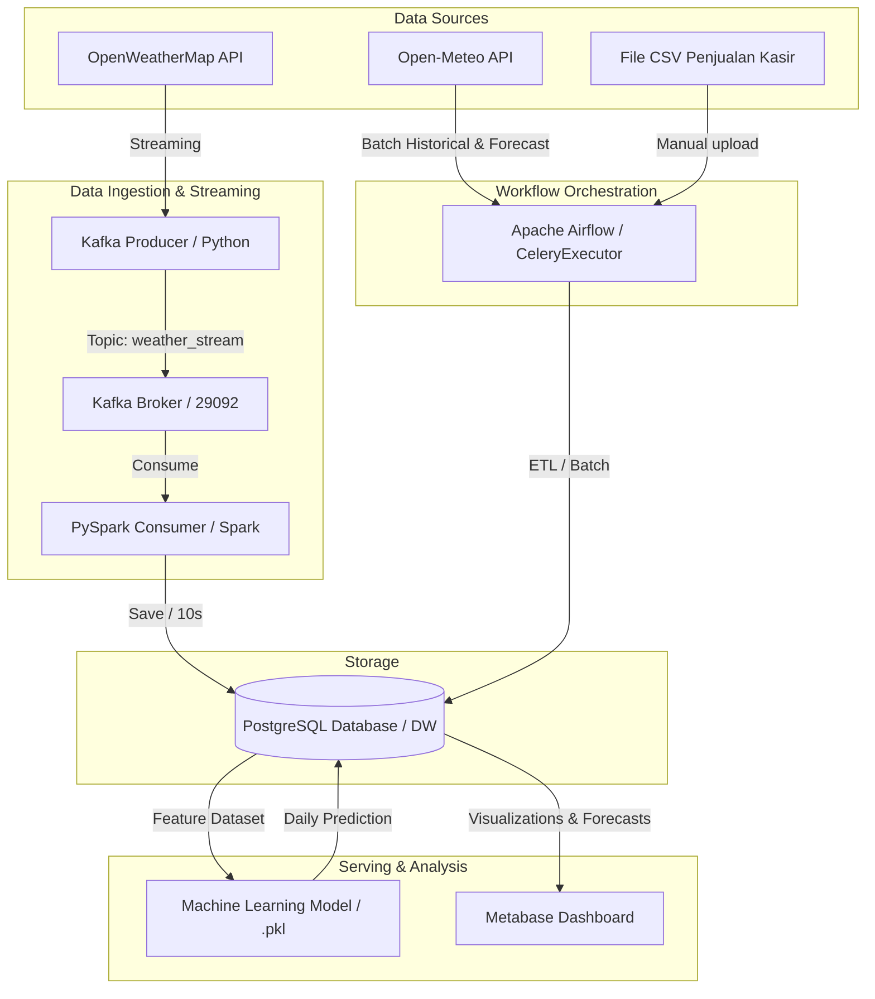

# TEMPLATE LAPORAN TEAM-BASED PROJECT (TBP)
## INFRASTRUKTUR DAN PLATFORM BIG DATA (PS. SAINS DATA - UNS)

---

### [PETUNJUK PENGGUNAAN TEMPLATE]
* *Ganti teks di dalam tanda kurung siku `[ ... ]` dengan konten proyek Anda.*
* *Template ini disusun berdasarkan format bab standar (3 Bab) dan disesuaikan untuk memuat ke-10 Indikator Penilaian TBP pada RPS.*
* *Setelah selesai diisi, Anda dapat menyalin isi dokumen ini (Markdown) dan menempelkannya ke Google Docs atau Microsoft Word untuk pemformatan akhir.*

---

## 1. COVER / HALAMAN JUDUL
*   **Judul Laporan**: Laporan Akhir Team-Based Project: Analisis Hubungan Cuaca dan Hari Libur terhadap Pendapatan Warkop Kusuma menggunakan Pipeline Big Data Terintegrasi
*   **Mata Kuliah**: Infrastruktur dan Platform Big Data
*   **Program Studi**: Sains Data, Fakultas Teknologi Informasi dan Sains Data, Universitas Sebelas Maret
*   **Anggota Tim**:
    1.  [Nama Anda / Jimly] - [NIM] (Infrastruktur & Core Pipeline)
    2.  [Nama Rekan Anda / Otniel] - [NIM] (Ops, Analytics, & Governance)
*   **Dosen Pengampu**: Fajar Muslim S.T., M.T.

---

## 2. ABSTRAK
*[Tuliskan ringkasan singkat (1 paragraf, maksimal 250 kata) dalam Bahasa Indonesia. Abstrak harus memuat latar belakang masalah Warkop Kusuma, tujuan pembuatan pipeline Big Data, metodologi/teknologi yang digunakan (Docker, Airflow, Kafka, Spark, PostgreSQL, Metabase, Machine Learning), serta kesimpulan/wawasan utama yang didapatkan.]*

---

## 3. DAFTAR ISI
*(Silakan buat daftar isi otomatis setelah laporan selesai disusun di Microsoft Word / Google Docs)*

---

## 4. DAFTAR TABEL
*(Silakan buat daftar tabel otomatis berdasarkan tabel-tabel data yang disisipkan di Bab II)*

---

## 5. DAFTAR GAMBAR
*(Silakan buat daftar gambar otomatis berdasarkan diagram arsitektur, gambar dashboard, dan grafik di Bab II)*

---

## BAB 1: PENDAHULUAN

### 1.1 Latar Belakang
*[Tuliskan latar belakang masalah bisnis Warkop Kusuma. Jelaskan mengapa data cuaca (suhu, curah hujan) dan data kalender (weekend, libur nasional) sangat penting dalam memengaruhi fluktuasi pendapatan harian warkop. Deskripsikan pula perlunya arsitektur Big Data modern untuk mengintegrasikan pengolahan data batch dan streaming secara otomatis.]*

### 1.2 Tujuan Proyek
*[Tuliskan tujuan spesifik dari proyek ini, seperti membangun arsitektur pipeline data hulu-ke-hilir tanpa ketergantungan cloud provider, menerapkan keamanan data (isolasi jaringan & RBAC), serta membangun model prediksi pendapatan berbasis Machine Learning.]*

### 1.3 Perancangan Arsitektur Pipeline (Indikator 1 - Bobot 10%)
#### 1.3.1 Desain Arsitektur End-to-End
Sistem dirancang secara mandiri (*on-premise*) menggunakan kontainer Docker untuk mengintegrasikan pengolahan batch dan real-time stream. Berikut adalah diagram desain arsitektur end-to-end:



#### 1.3.2 Peranan Komponen Arsitektur
Jelaskan aliran data secara rinci dari sumber data hingga visualisasi serta peranan komponen berikut:
*   **Docker**: Sebagai containerization untuk mengisolasi layanan.
*   **Apache Airflow**: Sebagai orkestrator workflow batch.
*   **Apache Kafka**: Sebagai message broker penampung data streaming cuaca.
*   **Apache Spark (PySpark)**: Sebagai processing engine untuk data streaming.
*   **PostgreSQL**: Sebagai Data Warehouse penyimpanan utama.
*   **Metabase**: Sebagai alat visualisasi data (Business Intelligence).

---

## BAB 2: HASIL DAN PEMBAHASAN

### 2.1 Implementasi Batch Processing (Indikator 2 - Bobot 10%)
#### 2.1.1 Alur Kerja Pipeline Batch (ETL)
Pemrosesan data batch yang dijadwalkan oleh Apache Airflow meliputi:
1.  **Pipeline Pendapatan Warkop (`pendapatan_warkop_pipeline`)**:
    *   *Sumber*: File CSV penjualan kasir yang diletakkan di `/opt/airflow/data/raw/`.
    *   *Alur*: Membaca data, membersihkan format, melakukan agregasi omzet harian per tanggal, dan mengunggahnya ke tabel `pendapatan_harian` di Postgres.
2.  **Pipeline Kalender & Hari Libur (`hari_libur_etl_pipeline`)**:
    *   *Sumber*: Ketetapan hari libur nasional (SKB 3 Menteri) yang didefinisikan secara manual pada skrip Python.
    *   *Alur*: Men-generate kalender lengkap satu tahun (mendeteksi weekend secara otomatis) dan memuatnya ke tabel `hari_libur`.
3.  **Pipeline Cuaca Tambahan (`cuaca_sukoharjo_sebulan_lalu_pipeline` & `cuaca_sukoharjo_prediksi_2minggu_pipeline`)**:
    *   *Sumber*: Open-Meteo Archive & Forecast API.
    *   *Alur*: Mengambil data cuaca batch (historis & ramalan 14 hari) lalu mengunggahnya ke database.

#### 2.1.2 Keandalan dan Idempotency
*[Jelaskan bagaimana pipeline batch menangani masalah duplikasi data jika dijalankan ulang (misalnya dengan menggunakan perintah DELETE rentang tanggal sebelum melakukan INSERT atau query ON CONFLICT UPSERT pada PostgreSQL).]*

---

### 2.2 Implementasi Stream Processing (Indikator 3 - Bobot 15%)
#### 2.2.1 Arsitektur Streaming Real-Time (Kafka & PySpark)
Sistem memproses aliran data cuaca real-time dengan interval 10 detik sebagai berikut:
*   **Kafka Producer** (`kafka_producer_weather.py`): Mengambil data cuaca Sukoharjo dari OpenWeatherMap API dan mempublikasikannya ke Kafka topic `weather_stream` setiap 10 detik.
*   **Kafka Broker**: Menjadi antrean pesan streaming yang andal.
*   **PySpark Structured Streaming** (`pyspark_consumer_weather.py`): Membaca streaming dari Kafka secara real-time, mengonversi skema JSON, melakukan pembersihan data (rounding desimal, pemetaan kode cuaca ke deskripsi teks), dan menyimpannya langsung ke database PostgreSQL (`cuaca_historis`).

#### 2.2.2 Analisis Perbandingan Batch vs Stream
*[Jelaskan analisis perbedaan antara pemrosesan batch dan stream di proyek ini dari segi latency, volume data, metode penyimpanan, dan teknologi yang digunakan.]*

---

### 2.3 Integrasi Pipeline dengan Machine Learning (Indikator 4 - Bobot 15%)
#### 2.3.1 Proses Pelatihan Model (Training Pipeline)
*   **Model**: RandomForestRegressor / GradientBoostingRegressor.
*   **Dataset**: Diambil dari view database SQL `vw_dataset_ml` yang menggabungkan histori omzet warkop, cuaca historis, dan kalender libur.
*   **Output**: Model yang sudah terlatih diekspor menjadi file serialisasi `model_prediksi_pendapatan.pkl`.

#### 2.3.2 Proses Prediksi (Inference Pipeline)
*   **Mekanisme**: Skrip `predict_to_postgres.py` memuat file `.pkl` menggunakan pustaka `joblib`.
*   **Input Fitur**: Prakiraan cuaca 14 hari ke depan (dari API) dikombinasikan dengan kalender libur mendatang.
*   **Penyimpanan**: Hasil prediksi pendapatan harian diunggah ke tabel database `prediksi_pendapatan` untuk siap ditampilkan ke dashboard.

---

### 2.4 Visualisasi & Dashboard Analitik (Indikator 5 - Bobot 10%)
#### 2.4.1 Desain Dashboard
*[Tuliskan metrik-metrik bisnis yang disajikan di halaman dashboard Metabase Anda, contohnya:]*
*   Total pendapatan mingguan/bulanan.
*   Grafik korelasi curah hujan terhadap fluktuasi pendapatan.
*   Grafik korelasi hari libur/weekend terhadap tingkat penjualan.
*   Tabel proyeksi/prediksi pendapatan 14 hari ke depan untuk estimasi stok bahan baku.

#### 2.4.2 Analisis Insight Bisnis Warkop Kusuma
*[Tuliskan temuan atau wawasan penting yang dihasilkan dari visualisasi data cuaca dan omzet warkop Anda (contoh: "Penjualan turun drastis saat curah hujan melebihi 10mm di jam operasional sore hari").]*

---

### 2.5 Sistem Monitoring, Logging & Alerting (Indikator 6 & 7 - Bobot 20%)
#### 2.5.1 Mekanisme Monitoring & Logging
*[Jelaskan sistem logging dan monitoring yang Anda pasang. Jika menggunakan Prometheus & Grafana untuk visualisasi performa kontainer, serta ELK Stack untuk sentralisasi log, deskripsikan cara kerjanya di sini.]*

#### 2.5.2 Sistem Notifikasi & Peringatan (Alerting System)
*[Jelaskan bagaimana sistem memberikan notifikasi apabila terjadi kegagalan pipeline (misalnya notifikasi error Airflow ke Telegram/Discord, atau alert Grafana ketika resource CPU kontainer melebihi ambang batas).]*

---

### 2.6 Keamanan Data (RBAC & Isolasi Jaringan) (Indikator 8 - Bobot 10%)
#### 2.6.1 Isolasi Jaringan (Network Isolation)
Kontainer dipecah menjadi 3 Docker network terisolasi (`orchestration-net`, `streaming-net`, `bi-net`). Layanan luar seperti Metabase tidak bisa langsung mengakses antrean pesan Kafka.

#### 2.6.2 Role-Based Access Control (RBAC)
*   **Database RBAC**: Akun database Metabase dikonfigurasi menggunakan user khusus `metabase_user` yang bersifat **Read-Only** (hanya hak akses SELECT) untuk mencegah manipulasi data dari dashboard.
*   **Airflow RBAC**: Membuat user tamu khusus dengan role **Viewer** (kredensial `viewer` / `viewerpass`) agar pihak luar dapat melihat DAG tanpa bisa mengeksekusi (*trigger*) atau merubahnya.

---

### 2.7 Tata Kelola Big Data (Data Governance) (Indikator 9 - Bobot 5%)
#### 2.7.1 Pengecekan Kualitas Data (Data Quality)
*[Jelaskan penerapan tata kelola data di proyek Anda, seperti penerapan pengecekan anomali data menggunakan pustaka Great Expectations (misalnya validasi tipe data atau penolakan data kosong/null).]*

#### 2.7.2 Data Lineage & Metadata
*[Jelaskan bagaimana pelacakan asal-usul data dari API/CSV mentah hingga menjadi visualisasi di Metabase dipetakan dan diaudit di sistem Anda.]*

---

## BAB 3: PENUTUP

### 3.1 Kesimpulan
*[Tuliskan kesimpulan akhir dari keberhasilan pembangunan infrastruktur Big Data dan manfaat prediksi pendapatan bagi Warkop Kusuma.]*

### 3.2 Saran
*[Tuliskan saran perbaikan infrastruktur untuk pengembangan sistem ke depan (misalnya migrasi ke arsitektur Cloud, peningkatan keandalan model ML, dll.).]*

### 3.3 Dokumentasi Operasional & Reproducibility (Indikator 10 - Bobot 5%)
#### 3.3.1 Panduan Instalasi dan Deployment
Untuk menjalankan sistem ini dari awal secara utuh, ikuti langkah berikut:

```bash
# 1. Kloning repositori
git clone [URL_REPO]
cd casebasedIPBD

# 2. Siapkan file .env dan masukkan API Key OpenWeatherMap Anda
echo "OPENWEATHERMAP_API_KEY=your_api_key_here" > .env

# 3. Jalankan seluruh container stack menggunakan Docker Compose
docker compose up -d --build

# 4. Inisialisasi database PostgreSQL RBAC
python scripts/scrapers/setup_db_rbac.py
```

#### 3.3.2 Cara Menguji Pipeline Streaming
Untuk menguji pipeline cuaca real-time 10 detik:
1.  Buka Airflow Web UI (`http://localhost:8080`) dan aktifkan serta jalankan DAG **`kafka_spark_streaming_control`** secara manual dengan sekali klik (Trigger DAG).
2.  DAG tersebut akan otomatis menyalakan background Producer di kontainer Airflow, sekaligus mengirimkan perintah HTTP untuk menjalankan PySpark Structured Streaming Consumer secara otomatis di dalam kontainer Spark.
3.  Pantau jalannya komputasi Spark streaming di browser: `http://localhost:4040` (Spark UI).
4.  *(Opsional)* Anda juga dapat memantau log streaming secara langsung dari host machine di dalam folder `logs/spark_consumer.log` dan `logs/spark_consumer_err.log`.
