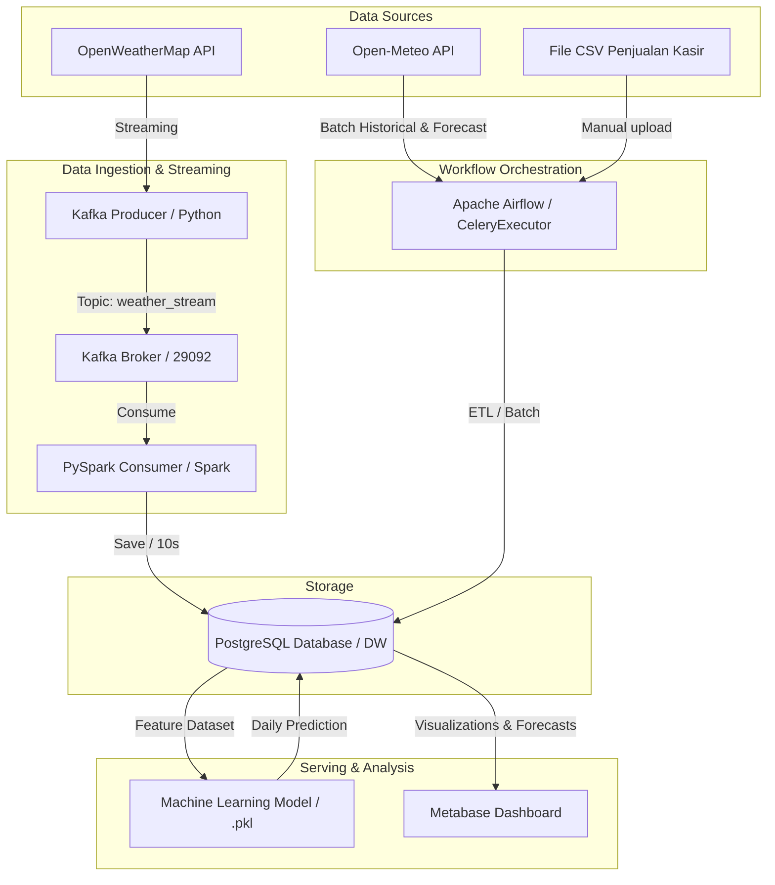

# TEMPLATE LAPORAN TEAM-BASED PROJECT (TBP)
## INFRASTRUKTUR DAN PLATFORM BIG DATA (PS. SAINS DATA - UNS)

---

### [PETUNJUK PENGGUNAAN TEMPLATE]
* *Ganti teks di dalam tanda kurung siku `[ ... ]` dengan konten proyek Anda.*
* *Template ini disusun berdasarkan 10 Indikator Penilaian TBP pada RPS mata kuliah.*
* *Setelah selesai diisi, Anda dapat menyalin isi dokumen ini (Markdown) dan menempelkannya ke Google Docs atau Microsoft Word untuk pemformatan akhir.*

---

## HALAMAN JUDUL
*   **Judul Laporan**: Laporan Akhir Team-Based Project: Analisis Hubungan Cuaca dan Hari Libur terhadap Pendapatan Warkop Kusuma menggunakan Pipeline Big Data Terintegrasi
*   **Mata Kuliah**: Infrastruktur dan Platform Big Data
*   **Program Studi**: Sains Data, Fakultas Teknologi Informasi dan Sains Data, Universitas Sebelas Maret
*   **Anggota Tim**:
    1.  [Nama Anda / Jimly] - [NIM] (Infrastruktur & Core Pipeline)
    2.  [Nama Rekan Anda / Otniel] - [NIM] (Ops, Analytics, & Governance)
*   **Dosen Pengampu**: Fajar Muslim S.T., M.T.

---

## DAFTAR ISI
*(Silakan buat daftar isi otomatis setelah laporan selesai disusun di Word/Docs)*

---

## RINGKASAN EKSEKUTIF (EXECUTIVE SUMMARY)
*[Tuliskan ringkasan singkat (1-2 paragraf) yang menjelaskan latar belakang proyek Warkop Kusuma, tujuan proyek, teknologi Big Data yang digunakan, serta hasil temuan analitik cuaca & prediksi pendapatan secara garis besar.]*

---

## BAB I: PERANCANGAN ARSITEKTUR PIPELINE (Bobot: 10%)
### 1.1 Desain Arsitektur End-to-End
*[Gambarkan arsitektur diagram sistem Anda di bawah ini (bisa menggunakan diagram fisik/Mermaid).]*



### 1.2 Aliran Data (Dataflow) dan Peran Komponen
*[Jelaskan bagaimana aliran data berjalan dari Data Source -> Ingestion -> Processing -> Storage -> Serving -> Dashboard secara terperinci. Sebutkan peran masing-masing teknologi berikut di dalam sistem Anda:]*
*   **Docker**: Sebagai containerization untuk mengisolasi layanan.
*   **Apache Airflow**: Sebagai orkestrator workflow batch.
*   **Apache Kafka**: Sebagai message broker penampung data streaming cuaca.
*   **Apache Spark (PySpark)**: Sebagai processing engine untuk data streaming.
*   **PostgreSQL**: Sebagai Data Warehouse penyimpanan utama.
*   **Metabase**: Sebagai alat visualisasi data (Business Intelligence).

---

## BAB II: BATCH PROCESSING PIPELINE (Bobot: 10%)
### 2.1 Alur Kerja Pipeline Batch (ETL)
Jelaskan alur pemrosesan data batch yang dijadwalkan oleh Apache Airflow:
1.  **Pipeline Pendapatan Warkop (`pendapatan_warkop_pipeline`)**:
    *   *Sumber Data*: File CSV penjualan kasir yang diletakkan di `/opt/airflow/data/raw/`.
    *   *Proses*: Skrip membaca data mentah, membersihkan format, melakukan agregasi omzet harian per tanggal, dan mengunggahnya ke tabel `pendapatan_harian` di Postgres.
2.  **Pipeline Kalender & Hari Libur (`hari_libur_etl_pipeline`)**:
    *   *Sumber Data*: Ketetapan hari libur nasional (SKB 3 Menteri) yang didefinisikan secara manual pada skrip Python.
    *   *Proses*: Men-generate kalender lengkap satu tahun (mendeteksi weekend secara otomatis) dan memuatnya ke tabel `hari_libur`.
3.  **Pipeline Cuaca Tambahan (`cuaca_sukoharjo_sebulan_lalu_pipeline` & `cuaca_sukoharjo_prediksi_2minggu_pipeline`)**:
    *   *Sumber Data*: Open-Meteo Archive & Forecast API.
    *   *Proses*: Mengambil data cuaca batch (historis & ramalan 14 hari) lalu mengunggahnya ke database.

### 2.2 Penanganan Duplikasi & Keandalan (Idempotency)
*[Jelaskan bagaimana kode Airflow Anda menjamin sifat idempotency (misalnya menggunakan mekanisme DELETE sebelum INSERT, atau ON CONFLICT UPSERT pada SQL untuk menghindari data ganda saat pipeline dijalankan ulang).]*

---

## BAB III: STREAM PROCESSING PIPELINE (Bobot: 15%)
### 3.1 Arsitektur Streaming Real-Time (Kafka & PySpark)
Jelaskan bagaimana data cuaca real-time diproses tanpa henti:
*   **Kafka Producer**: Mengambil data cuaca Sukoharjo dari OpenWeatherMap API dan mempublikasikannya ke Kafka topic `weather_stream` setiap 10 detik.
*   **Kafka Broker**: Menjadi antrean pesan streaming yang andal.
*   **PySpark Structured Streaming**: Membaca streaming dari Kafka secara real-time, mengonversi skema JSON, melakukan pembersihan data (rounding desimal, pemetaan kode cuaca ke deskripsi teks), dan menyimpannya langsung ke database PostgreSQL (`cuaca_historis`).

### 3.2 Perbedaan Pemrosesan Stream vs Batch
*[Jelaskan analisis perbedaan antara pemrosesan batch dan stream di proyek ini dari segi waktu respon (latency), volume data, metode penyimpanan, dan teknologi yang digunakan.]*

---

## BAB IV: INTEGRASI PIPELINE DENGAN MACHINE LEARNING (Bobot: 15%)
### 4.1 Proses Pelatihan Model (Training Pipeline)
*   **Model**: RandomForestRegressor / GradientBoostingRegressor.
*   **Dataset**: Diambil dari view database SQL `vw_dataset_ml` yang menggabungkan histori omzet warkop, cuaca historis, dan kalender libur.
*   **Output**: Model yang sudah terlatih diekspor menjadi file serialisasi `model_prediksi_pendapatan.pkl`.

### 4.2 Proses Prediksi (Inference Pipeline)
*   **Mekanisme**: Skrip `predict_to_postgres.py` memuat file `.pkl` menggunakan pustaka `joblib`.
*   **Input Fitur**: Prakiraan cuaca 14 hari ke depan (dari API) dikombinasikan dengan kalender libur mendatang.
*   **Penyimpanan**: Hasil prediksi pendapatan harian diunggah ke tabel database `prediksi_pendapatan` untuk siap ditampilkan ke dashboard.

---

## BAB V: VISUALISASI DAN DASHBOARD METABASE (Bobot: 10%)
### 5.1 Desain Dashboard
*[Tuliskan metrik-metrik bisnis yang disajikan di halaman dashboard Metabase Anda, contohnya:]*
*   Total pendapatan mingguan/bulanan.
*   Grafik korelasi curah hujan terhadap fluktuasi pendapatan.
*   Grafik korelasi hari libur/weekend terhadap tingkat penjualan.
*   Tabel proyeksi/prediksi pendapatan 14 hari ke depan untuk estimasi stok bahan baku.

### 5.2 Analisis Insight Bisnis Warkop Kusuma
*[Tuliskan temuan atau wawasan penting yang dihasilkan dari visualisasi data cuaca dan omzet warkop Anda (contoh: "Penjualan turun drastis saat curah hujan melebihi 10mm di jam operasional sore hari").]*

---

## BAB VI: MONITORING, LOGGING, & ALERTING (Bobot: 20%)
### 6.1 Mekanisme Monitoring & Logging (Observability)
*[Jelaskan sistem logging dan monitoring yang Anda pasang. Jika menggunakan Prometheus & Grafana untuk visualisasi performa kontainer, serta ELK Stack untuk sentralisasi log, deskripsikan cara kerjanya di sini.]*

### 6.2 Sistem Notifikasi & Peringatan (Alerting System)
*[Jelaskan bagaimana sistem memberikan notifikasi apabila terjadi kegagalan pipeline (misalnya notifikasi error Airflow ke Telegram/Discord, atau alert Grafana ketika resource CPU kontainer melebihi ambang batas).]*

---

## BAB VII: KEAMANAN DATA & BIG DATA GOVERNANCE (Bobot: 15%)
### 7.1 Keamanan Data (Network Isolation & RBAC)
*   **Isolasi Jaringan**: Kontainer dipecah menjadi 3 Docker network terisolasi (`orchestration-net`, `streaming-net`, `bi-net`). Layanan luar seperti Metabase tidak bisa langsung mengakses antrean pesan Kafka.
*   **Database RBAC**: Akun database Metabase dikonfigurasi menggunakan user khusus `metabase_user` yang bersifat **Read-Only** (hanya hak akses SELECT) untuk mencegah manipulasi data dari dashboard.
*   **Airflow RBAC**: Membuat user tamu khusus dengan role **Viewer** (kredensial `viewer` / `viewerpass`) agar pihak luar dapat melihat DAG tanpa bisa mengeksekusi (*trigger*) atau merubahnya.

### 7.2 Big Data Governance
*[Jelaskan penerapan tata kelola data di proyek Anda, seperti:]*
*   **Kualitas Data (Data Quality)**: Penerapan pengecekan anomali data (misalnya validasi tipe data atau penolakan data kosong/null menggunakan pustaka *Great Expectations*).
*   **Data Lineage & Metadata**: Pelacakan asal-usul data dari API/CSV mentah hingga menjadi visualisasi di Metabase.

---

## BAB VIII: DOKUMENTASI & REPRODUCIBILITY (Bobot: 5%)
### 8.1 Panduan Instalasi dan Deployment
Untuk menjalankan sistem ini dari awal secara utuh, ikuti langkah berikut:

```bash
# 1. Kloning repositori
git clone [URL_REPO]
cd casebasedIPBD

# 2. Siapkan file .env dan masukkan API Key OpenWeatherMap Anda
echo "OPENWEATHERMAP_API_KEY=your_api_key_here" > .env

# 3. Jalankan seluruh container stack menggunakan Docker Compose
docker compose up -d --build

# 4. Inisialisasi database PostgreSQL RBAC
python scripts/scrapers/setup_db_rbac.py
```

### 8.2 Cara Menguji Pipeline Streaming
Untuk menguji pipeline cuaca real-time 10 detik:
1.  Buka Airflow Web UI (`http://localhost:8080`) dan jalankan DAG `kafka_spark_streaming_control` secara manual untuk menyalakan background producer.
2.  Jalankan Spark consumer di dalam kontainer Spark dengan perintah:
    ```bash
    docker exec -it warkop_pyspark /opt/spark/bin/spark-submit --packages org.apache.spark:spark-sql-kafka-0-10_2.12:3.5.1 /opt/airflow/scrapers/pyspark_consumer_weather.py
    ```
3.  Pantau jalannya komputasi Spark streaming di browser: `http://localhost:4040`.

---

## BAB IX: KESIMPULAN DAN SARAN
### 9.1 Kesimpulan
*[Tuliskan kesimpulan akhir dari keberhasilan pembangunan infrastruktur Big Data dan manfaat prediksi pendapatan bagi Warkop Kusuma.]*

### 9.2 Saran Pengembangan
*[Tuliskan saran perbaikan infrastruktur untuk pengembangan sistem ke depan (misalnya migrasi ke arsitektur Cloud, peningkatan algoritma ML, dll.).]*
